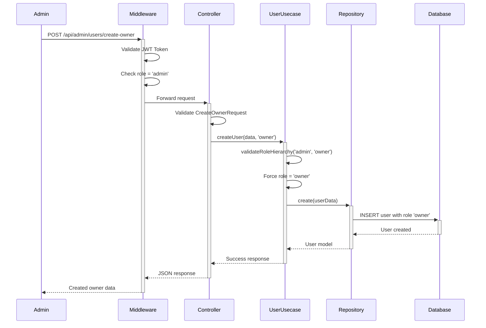
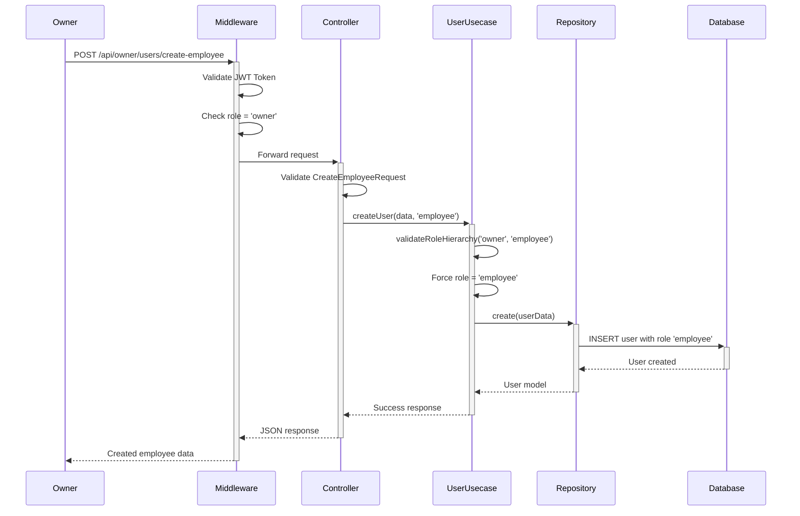

# Role-Based User Creation Hierarchy Documentation

## Overview

The Pioneer Management system implements a strict role hierarchy for user creation that ensures proper access control and prevents privilege escalation. This document outlines the complete flow, security measures, and implementation details.

## Role Hierarchy Structure

```
Admin (Top Level)
  ├── Can create: Owner accounts
  └── Cannot create: Employee accounts (must go through Owner)
  └── Cannot create: Admin accounts (system restriction)

Owner (Middle Level)  
  ├── Can create: Employee accounts
  └── Cannot create: Admin or Owner accounts

Employee (Bottom Level)
  └── Cannot create: Any accounts
```

## Implementation Architecture

### Clean Architecture Layers

1. **Repository Layer** (`app/Repository/UserRepository.php`)
   - Handles database operations
   - User model interactions
   - Data persistence

2. **Usecase Layer** (`app/Usecase/UserUsecase.php`)
   - Business logic implementation
   - Role hierarchy validation
   - Authentication logic

3. **Delivery Layer** (`app/Delivery/Http/Controllers/UserController.php`)
   - HTTP request handling
   - Response formatting
   - Route management

## Security Implementation

### 1. Route-Level Security

```php
// Admin routes - Protected by role middleware
Route::middleware(['auth:sanctum', 'role:admin'])->prefix('admin')->group(function () {
    Route::post('/users/create-owner', [UserController::class, 'createOwner']);
});

// Owner routes - Protected by role middleware
Route::middleware(['auth:sanctum', 'role:owner'])->prefix('owner')->group(function () {
    Route::post('/users/create-employee', [UserController::class, 'createEmployee']);
});

// No employee user creation routes exist (by design)
```

### 2. Business Logic Security

```php
// UserUsecase::validateRoleHierarchy()
private function validateRoleHierarchy(string $creatorRole, string $targetRole): void
{
    $allowedCreations = [
        'admin' => ['owner'],
        'owner' => ['employee'],
        'employee' => [] // Cannot create any users
    ];

    if (!isset($allowedCreations[$creatorRole])) {
        throw new Exception("Invalid creator role: {$creatorRole}");
    }

    if (!in_array($targetRole, $allowedCreations[$creatorRole])) {
        throw new Exception("{$creatorRole} can only create: " . implode(', ', $allowedCreations[$creatorRole]));
    }
}
```

### 3. Input Validation Security

- **CreateOwnerRequest**: Validates owner-specific fields, excludes `account_role`
- **CreateEmployeeRequest**: Validates employee-specific fields, excludes `account_role`
- Automatic role assignment prevents role manipulation

## Complete User Creation Flow

### 1. Authentication Flow
```
User Login → JWT Token Generation → Role Extraction → Route Access Control
```

**Steps:**
1. User authenticates via `/api/auth/login`
2. System validates credentials
3. JWT token generated with user role
4. Token used for subsequent API calls
5. Middleware validates token and extracts role

### 2. Admin Creating Owner Flow



### 3. Owner Creating Employee Flow



## API Endpoints

### Authentication Endpoints

#### Login
```http
POST /api/auth/login
Content-Type: application/json

{
    "username_or_email": "admin@example.com",
    "password": "password123"
}
```

**Response:**
```json
{
    "success": true,
    "message": "Login successful",
    "data": {
        "user": {
            "id": "uuid",
            "name": "Admin User",
            "email": "admin@example.com",
            "account_role": "admin"
        },
        "token": "1|eyJ0eXAiOiJKV1Q..."
    }
}
```

#### Register (Admin Only - Initial Setup)
```http
POST /api/auth/register
Content-Type: application/json

{
    "name": "System Admin",
    "email": "admin@system.com",
    "username": "sysadmin",
    "password": "securepassword123",
    "password_confirmation": "securepassword123"
}
```

### Role-Based User Creation Endpoints

#### Admin Creates Owner
```http
POST /api/admin/users/create-owner
Authorization: Bearer {admin_token}
Content-Type: application/json

{
    "name": "John Doe",
    "email": "john@example.com",
    "username": "johndoe",
    "password": "password123",
    "password_confirmation": "password123",
    "phone": "1234567890",
    "business_name": "John's Coffee Shop",
    "business_description": "Premium coffee and pastries",
    "business_category": "Food & Beverage"
}
```

**Response:**
```json
{
    "success": true,
    "message": "Owner created successfully",
    "data": {
        "user": {
            "id": "uuid",
            "name": "John Doe",
            "email": "john@example.com",
            "username": "johndoe",
            "account_role": "owner",
            "phone": "1234567890",
            "created_at": "2025-11-09T10:30:00Z"
        }
    }
}
```

#### Owner Creates Employee
```http
POST /api/owner/users/create-employee
Authorization: Bearer {owner_token}
Content-Type: application/json

{
    "name": "Jane Smith",
    "email": "jane@example.com",
    "username": "janesmith",
    "password": "password123",
    "password_confirmation": "password123",
    "phone": "0987654321",
    "birth_of_date": "1990-05-15",
    "birth_of_place": "Jakarta",
    "gender": "female",
    "start_date": "2025-11-09",
    "placement": "Jakarta Office",
    "job_role": "Cashier",
    "salary": 5000000,
    "business_id": 1
}
```

**Response:**
```json
{
    "success": true,
    "message": "Employee created successfully",
    "data": {
        "user": {
            "id": "uuid",
            "name": "Jane Smith",
            "email": "jane@example.com",
            "username": "janesmith",
            "account_role": "employee",
            "job_role": "Cashier",
            "placement": "Jakarta Office",
            "salary": 5000000,
            "business_id": 1,
            "created_at": "2025-11-09T10:30:00Z"
        }
    }
}
```

### Password Management Endpoints

#### Forgot Password
```http
POST /api/auth/forgot-password
Content-Type: application/json

{
    "email": "user@example.com"
}
```

#### Reset Password
```http
POST /api/auth/reset-password
Content-Type: application/json

{
    "email": "user@example.com",
    "token": "reset_token_here",
    "password": "newpassword123",
    "password_confirmation": "newpassword123"
}
```

## Error Handling

### Role Hierarchy Violations

#### Admin Trying to Create Employee (Blocked at Route Level)
```json
{
    "success": false,
    "message": "Route not found",
    "error": "The specified route does not exist or you don't have access"
}
```

#### Owner Trying to Create Admin (Blocked at Business Logic Level)
```json
{
    "success": false,
    "message": "Owner can only create: employee",
    "error": "ROLE_HIERARCHY_VIOLATION"
}
```

#### Employee Trying to Create Any User (Blocked at Route Level)
```json
{
    "success": false,
    "message": "Access denied",
    "error": "No user creation routes available for employee role"
}
```

### Authentication Errors

#### Invalid Token
```json
{
    "success": false,
    "message": "Unauthenticated",
    "error": "Token is invalid or expired"
}
```

#### Insufficient Permissions
```json
{
    "success": false,
    "message": "Access denied",
    "error": "Insufficient permissions for this action"
}
```

### Validation Errors

#### Missing Required Fields
```json
{
    "success": false,
    "message": "Validation failed",
    "errors": {
        "name": ["The name field is required."],
        "email": ["The email field is required."],
        "password": ["The password must be at least 8 characters."]
    }
}
```

#### Duplicate Email/Username
```json
{
    "success": false,
    "message": "Validation failed", 
    "errors": {
        "email": ["The email has already been taken."],
        "username": ["The username has already been taken."]
    }
}
```

## Database Schema

### Users Table Structure
```sql
CREATE TABLE users (
    id CHAR(36) PRIMARY KEY,
    name VARCHAR(255) NOT NULL,
    email VARCHAR(255) UNIQUE NOT NULL,
    username VARCHAR(255) UNIQUE NOT NULL,
    email_verified_at TIMESTAMP NULL,
    password VARCHAR(255) NOT NULL,
    account_role ENUM('admin', 'owner', 'employee') DEFAULT 'employee',
    phone VARCHAR(255) NULL,
    birth_of_date DATE NULL,
    birth_of_place VARCHAR(255) NULL,
    gender VARCHAR(255) NULL,
    start_date DATE NULL,
    end_date DATE NULL,
    placement VARCHAR(255) NULL,
    job_role VARCHAR(255) NULL,
    salary DECIMAL(15,2) NULL,
    business_id BIGINT UNSIGNED NULL,
    remember_token VARCHAR(100) NULL,
    created_at TIMESTAMP NULL,
    updated_at TIMESTAMP NULL,
    
    FOREIGN KEY (business_id) REFERENCES business(id) ON DELETE SET NULL
);
```

## Security Best Practices Implemented

### 1. **Defense in Depth**
- Route-level middleware protection
- Business logic validation
- Database constraints
- Input sanitization

### 2. **Principle of Least Privilege**
- Each role can only perform necessary actions
- No role can escalate privileges
- Employee role has no user creation capabilities

### 3. **Role Separation**
- Clear boundaries between admin, owner, employee
- Forced role assignment prevents manipulation
- No cross-role privilege sharing

### 4. **Input Validation**
- Role-specific validation classes
- Required field enforcement
- Data type validation
- Business rule validation

### 5. **Token-Based Authentication**
- JWT tokens with role information
- Token expiration handling
- Secure token storage requirements

## Testing Scenarios

### 1. **Valid Role Hierarchy Tests**
```bash
# Admin creates owner - Should succeed
POST /api/admin/users/create-owner (with admin token)

# Owner creates employee - Should succeed  
POST /api/owner/users/create-employee (with owner token)
```

### 2. **Invalid Role Hierarchy Tests**
```bash
# Admin tries to create employee directly - Should fail (404)
POST /api/admin/users/create-employee (route doesn't exist)

# Owner tries to create admin - Should fail (403)
POST /api/owner/users/create-admin (route doesn't exist)

# Employee tries to create anyone - Should fail (403)
POST /api/employee/users/* (no routes available)
```

### 3. **Authentication Tests**
```bash
# No token provided - Should fail (401)
POST /api/admin/users/create-owner (no Authorization header)

# Invalid token - Should fail (401)
POST /api/admin/users/create-owner (invalid token)

# Wrong role token - Should fail (403)
POST /api/admin/users/create-owner (with owner/employee token)
```

## Deployment Checklist

### 1. **Database Migrations**
```bash
php artisan migrate
```

### 2. **Clear Cache**
```bash
php artisan config:clear
php artisan route:clear  
php artisan cache:clear
```

### 3. **Verify Routes**
```bash
php artisan route:list --name=admin
php artisan route:list --name=owner
```

### 4. **Test Authentication**
- Verify JWT token generation
- Test role-based middleware
- Confirm route protections

### 5. **Security Verification**
- Test role hierarchy enforcement
- Verify input validation
- Confirm error handling

## Maintenance Notes

### 1. **Adding New Roles**
- Update `validateRoleHierarchy()` method
- Add new middleware rules
- Create role-specific routes
- Update documentation

### 2. **Modifying Role Permissions** 
- Review security implications
- Update business logic validation
- Test all affected scenarios
- Update API documentation

### 3. **Monitoring**
- Log role hierarchy violations
- Monitor authentication failures
- Track user creation patterns
- Audit role assignments

This documentation provides a complete reference for the role-based user creation hierarchy system, ensuring proper implementation, security, and maintenance of the access control system.